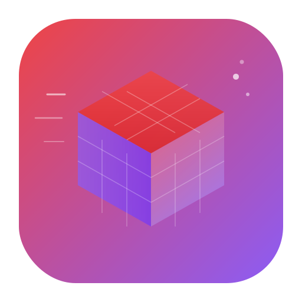

<p align="center">
  
</p>

<h1 align="center">SpeedCube AI</h1>

<p align="center">
  The most comprehensive speedcubing knowledge base — algorithms, methods, hardware, records, and an AI assistant.
</p>

<p align="center">
  
  
  
  
</p>

---

## Features

- **4 200+ algorithms** across 78 sets — OLL, PLL, F2L, ZBLL, COLL, CLL, EG, and more
- **76 solving methods** — from beginner LBL to expert ZB and Nautilus
- **970+ cubes & 30+ lubes** — prices, features, ratings from top retailers
- **WCA records** — live world records for all 17 official events
- **AI chat assistant** — ask questions in French or English, get precise answers with inline 3D previews
- **3D algorithm viewer** — interactive `cubing.js` player for every algorithm
- **170 glossary terms**, **55 tips**, **15 learning paths**
- **Full i18n** — French and English UI
- **Dark / light / system theme** with anti-flash
- **Command palette** (Cmd+K) — instant search across the entire knowledge base

## Tech Stack

| Layer | Technology |
|-------|-----------|
| Framework | React 19, TypeScript 5.9 |
| Styling | Tailwind CSS 4, Framer Motion |
| Routing | React Router 7 |
| Build | Vite 7, pnpm |
| AI | OpenRouter (Trinity, Nemotron, Solar) |
| 3D | cubing.js 0.63 |
| i18n | i18next, react-i18next |
| Deploy | Docker, Nginx, Coolify |

## Quick Start

```bash
# Clone
git clone https://github.com/your-username/speedcube-ai.git
cd speedcube-ai

# Install
pnpm install

# Configure
cp .env.example .env
# Add your OpenRouter API key to .env

# Dev server
pnpm dev
```

Open [http://localhost:5173](http://localhost:5173).

## Project Structure

```
speedcube-ai/
├── src/
│   ├── components/
│   │   ├── ui/              # Reusable UI components (Button, Card, Modal...)
│   │   ├── layout/          # Header, Sidebar, Footer, Layout shell
│   │   ├── ChatAssistant    # AI chat with streaming + 3D previews
│   │   └── AlgorithmDetailModal
│   ├── pages/               # Route pages (Dashboard, Algorithms, Methods...)
│   ├── data/                # Knowledge base (JSON)
│   │   ├── algorithms/      # 78 algorithm set files
│   │   ├── methods/         # 76 method files
│   │   ├── hardware/        # Cubes + lubes catalogs
│   │   └── metadata.ts      # Pre-computed stats (no heavy import)
│   ├── hooks/               # useTheme, useSearch, useCommandPalette
│   ├── lib/                 # AI client, search engine, utilities
│   └── i18n/locales/        # FR + EN translation files
├── scripts/                 # Data scrapers + generation pipeline
├── Dockerfile               # Multi-stage build (Node → Nginx)
├── nginx.conf               # SPA routing + gzip + caching
└── .github/workflows/       # Coolify auto-deploy on push
```

## Data Pipeline

```
speedcubedb.com  ──►  scrape-speedcubedb.ts  ──►  algorithms/*.json  ──┐
jperm.net        ──►  scrape-jperm.ts        ──►  (merge OLL/PLL)    ──┤
WCA API          ──►  scrape-wca-records.ts  ──►  records.json       ──┤
TheCubicle / SCS ──►  scrape-shops.ts        ──►  hardware/*.json    ──┼──► generate-knowledge.ts
Manual curation  ──────────────────────────────►  methods/*.json     ──┤        ↓
                                                   glossary.json      ──┤   index.ts + metadata.ts
                                                   tips.json          ──┤
                                                   learning-paths.json──┘
```

```bash
pnpm run scrape:all     # Scrape all sources
pnpm run generate       # Validate + regenerate index
pnpm run build          # Production build (~329KB gzip initial)
```

## Performance

- **Lazy routes** — all pages except Dashboard use `React.lazy()`
- **Code splitting** — data (2.1 MB) loads on-demand, not at startup
- **Manual chunks** — `data`, `framer-motion`, `cubing.js` split into separate bundles
- **Initial load** — ~329 KB gzip (React + Framer + CSS)
- **Metadata module** — Dashboard and Footer use lightweight pre-computed stats

## AI Chat

The assistant uses free models via [OpenRouter](https://openrouter.ai) with a 3-model fallback chain:

1. **Trinity** (primary) → 2. **Nemotron** → 3. **Solar**

Features:
- Client-side off-topic filter — instant rejection of non-speedcubing questions
- Language detection (FR/EN) with conversation context awareness
- Topic-aware search — injects relevant data chunks (max 6, capped at 15K chars)
- Inline 3D algorithm previews via cubing.js
- Streaming responses

## Deployment

The app is deployed to [Coolify](https://coolify.io) via GitHub Actions.

**Setup in Coolify:**
1. New Resource → **Dockerfile**
2. Point to this repository
3. Set build variable: `VITE_OPENROUTER_API_KEY`
4. Set domain: `db.speedcubemaster.app`
5. Copy the resource UUID into GitHub secret `COOLIFY_SPEEDCUBE_AI_UUID`

Every push to `main` triggers automatic deployment.

## Scripts

| Command | Description |
|---------|-------------|
| `pnpm dev` | Start dev server |
| `pnpm build` | Production build |
| `pnpm run scrape:speedcubedb` | Scrape algorithms from SpeedCubeDB |
| `pnpm run scrape:wca` | Scrape WCA world records |
| `pnpm run scrape:all` | Run all scrapers |
| `pnpm run generate` | Validate data + regenerate index |

## License

Private project. All rights reserved.
